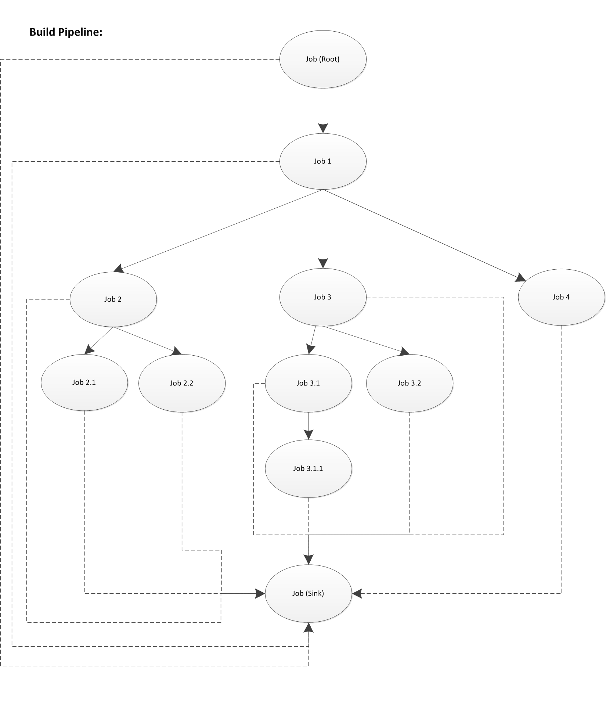
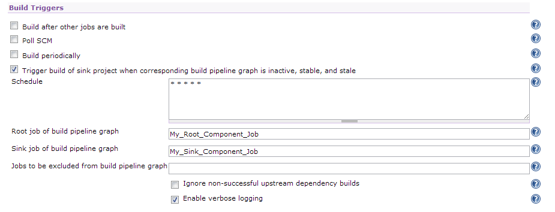

## Pipeline Sink Trigger Plugin

A custom Hudson plugin primarily used for periodically scheduling a build of a configured sink job if and only if the corresponding build pipeline graph is 
inactive, stable, and stale:

*   **Inactive:** None of the jobs that make up the nodes (i.e. vertices) of the build pipeline graph are currently running, or scheduled in the build queue.
*   **Stable:** The last build status (if present) for each job that make up the nodes of the build pipeline graph were successful. This rule can be relaxed by selecting the _**Ignore non-successful upstream dependency builds**_ option (however this is not recommended as it goes against CI best practices).
*   **Stale:** The last build of the sink job was prior to any of the build jobs that make up the nodes of the build pipeline graph.
  
All rules must comply in order for a build of the sink job to be scheduled.

## Background

Suppose you are building a software product which is assembled from multiple components, and these components (developed by different teams perhaps) themselves 
have inter-dependencies with each other, you effectively end up with a build pipeline that can be modelled as a graph (i.e. tree), for example:

Using the above example, we see that **Component 1** (which is built by Hudson - represented by the **Job 1** node) has a dependency on **Component Root**
(which is built by Hudson - represented by the **Job (Root)** node). Furthermore, we see that **Component 2**, **Component 3**, and **Component 4** have
a dependency on **Component 1**, but they themselves do not depend on each other, thus they can be built independently from each other, and take advantage
of Hudson's built in support for parallelized builds. The branching can extend as deep as necessary.

Another observation that cannot escape our attention is how all component build jobs converge on **Job (Sink)**. This **Job (Sink)** represents the Hudson
build job for our software product that we intend to deliver to our end user(s). For example, this build job may be responsible for assembling all of the 
upstream components as an .exe.

Out of the box, Hudson supports triggering builds of the other projects (once a build is successfully completed) thereby constructing, and managing the
corresponding dependency build graph (aka _build pipeline graph_). However, this support does not particularly extend well to use cases where a _converging_ 
sink component needs to be built whenever an upstream component has been changed (as depicted by the above example):

What happens when a code change has been checked into the code line for **Component 1**?

1.  Hudson will trigger/schedule a build of **Component 1** using the **Job 1** configuration (note: here we are assuming our jobs are configured to poll 
changes in SCM).
2.  **Component 1** gets built (i.e. compile/test/etc.).
3.   Hudson triggers the downstream builds of **Component 2**, **Component 3**,  **Component 4**, and **Job (Sink)** (remember that **Job (Sink)** represents 
the Hudson build job for our software product that we intend to deliver).
4.  **Component 2** gets built (for the purposes of illustration ignore build order queue).
5.  Hudson triggers the downstream builds for **Component 2**: **Component 2.1**, **Component 2.2**,  and **Job (Sink)** (again!!).
6.  And so on and so forth...

We see that the **Job (Sink)** gets triggered numerous times for a single code change! 

How do we avoid such unnecessary building of **Sink** component? 

1.  Remove the link (i.e. edge) from each component job configuration to the sink job (this is easy - just don't specify the **Job (Sink)** in the 
_Build other jobs_ post build action).
2.  Implement an observer/listener mechanism that is capable of triggering a build of **Job (Sink)** whenever a change in any of the upstream components
has been detected, yet try to avoid unnecessary repetive builds (Hudson has no support for this - this plugin aims at providing this mechanism).

## Configuration

*   **Schedule:** The cron-like expression used for periodically testing if a build of the configured sink job should be scheduled or not 
(for example, **\* \* \* \* \*** will run the this plugin's trigger every minute).
*   **Root job of build pipeline graph:** The root project of the build pipeline graph.
*   **Sink job of build pipeline graph:** The sink project of the build pipeline graph.
*   **Jobs to be excluded from build pipeline graph:** Comma-separated list of projects that are part of the build pipeline graph, but should be excluded 
when determining if the sink job should be triggered or not. Note: If the excluded project is configured to build downstream projects, then these projects 
will also be excluded. Disabled projects are always excluded.
*   **Ignore non-successful upstream dependency builds:** If checked, then non-successful upstream dependency builds for which the corresponding build pipeline 
graph relies on will be ignored when determining if a build of the sink project should be scheduled or not. It is recommended to leave this option unchecked.
*   **Enable verbose logging:** Flag indicating if extra logging should be outputted to the system log.

## Building

TODO

## Notes

TODO  

## License

TODO  